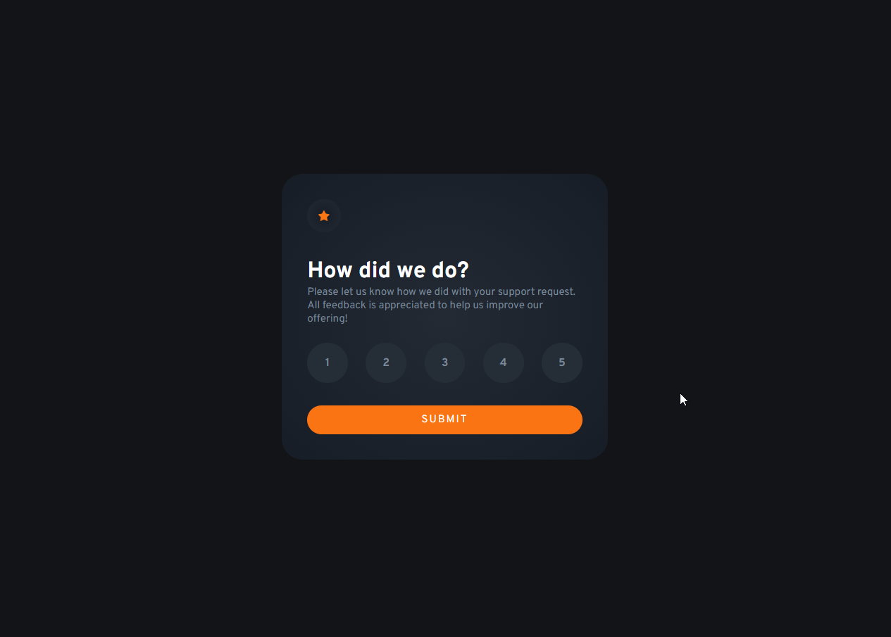

# Frontend Mentor - Interactive rating component solution

This is a solution to the [Interactive rating component challenge on Frontend Mentor](https://www.frontendmentor.io/challenges/interactive-rating-component-koxpeBUmI). Frontend Mentor challenges help you improve your coding skills by building realistic projects. 

## Table of contents

- [Frontend Mentor - Interactive rating component solution](#frontend-mentor---interactive-rating-component-solution)
  - [Table of contents](#table-of-contents)
  - [Overview](#overview)
    - [The challenge](#the-challenge)
    - [Screenshot](#screenshot)
    - [Links](#links)
  - [My process](#my-process)
    - [Built with](#built-with)
    - [What I learned](#what-i-learned)
  - [Author](#author)

## Overview

### The challenge

Users should be able to:

- View the optimal layout for the app depending on their device's screen size
- See hover states for all interactive elements on the page
- Select and submit a number rating
- See the "Thank you" card state after submitting a rating

### Screenshot



### Links

- Solution URL: [Add solution URL here](https://your-solution-url.com)
- Live Site URL: [Add live site URL here](https://your-live-site-url.com)

## My process

### Built with

- Semantic HTML5 markup
- CSS custom properties
- Flexbox
- CSS Grid
- Mobile-first workflow
- JavaScript

### What I learned
- I learn how to use form submits + JS DOM to trigger CSS animations

```html
<form id="ratings-form">
  <div class="ratings">
    <label class="ratings__btn" for="rating-1">
      <input type="radio" name="rating" id="rating-1" data-ratingButton data-rating="1"> 1
    </label>
    <label class="ratings__btn" for="rating-2">
      <input type="radio" name="rating" id="rating-2" data-ratingButton data-rating="2"> 2
    </label>
    <label class="ratings__btn" for="rating-3">
      <input type="radio" name="rating" id="rating-3" data-ratingButton data-rating="3"> 3
    </label>
    <label class="ratings__btn" for="rating-4">
      <input type="radio" name="rating" id="rating-4" data-ratingButton data-rating="4"> 4
    </label>
    <label class="ratings__btn" for="rating-5">
      <input type="radio" name="rating" id="rating-5" data-ratingButton data-rating="5"> 5
    </label>
  </div>

  <button class="btn">Submit</button>
</form>
```

```css
.card--submitted {
  position: absolute;
  text-align: center;
  top: 0;
  left: 0;
  width: 100%;
  height: 100%;
  z-index: -1;
  opacity: 0;
  transition: opacity 300ms ease-in;
}

.card--submitted.show {
    z-index: 100;
    opacity: 1;
}
```

```js
ratingsForm.addEventListener('submit', (event) => {
  event.preventDefault()
  cardSubmitted.classList.add('show')
})
```

- I learn how to use data-attributes to update the DOM

```js
ratingButtons.forEach(ratingButton => {
    ratingButton.addEventListener('click', () => {
        const rating = ratingButton.getAttribute('data-rating')
        ratingMessage.textContent = `You selected ${rating} out of 5`
    })
})
```

## Author

- Website - [Wellington Damasio](https://www.wellingtondamasio.com)
- Frontend Mentor - [@wellington-damasio](https://www.frontendmentor.io/profile/wellington-damasio)